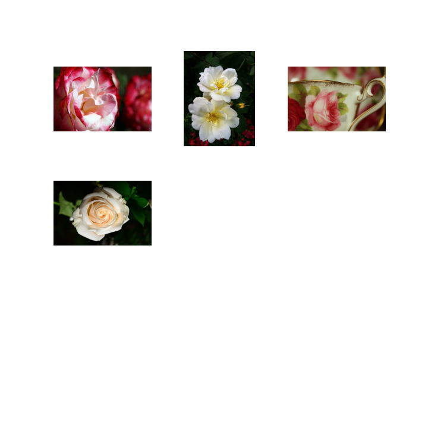
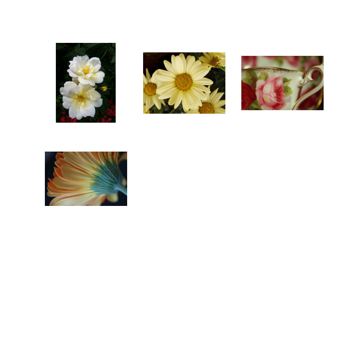

```{r setup, include=FALSE}
knitr::opts_chunk$set(echo = TRUE)
knitr::opts_chunk$set(fig.pos = 'h')
```

## 1. Introduction

Image search is a common application for machine learning. Visual searches are performed by representing visual data, such as images or videos in a lower-dimensional space, a visual embedding. Then these embedding are compared by tests such as the cosine similarity test to find similar images. The goal of this paper is to the efficacy of a stratified visual search when images are known to belong into distinct categories.

## 2. Data

The data for this paper comes from a Kaggle dataset called Flowers Recognition [@flowers]. The images were scraped from scraped data from flickr, google images, and yandex images. The dataset contains 4242 images of flowers from 5 types of flowers: daisy, tulip, rose, sunflower, dandelion. The daisy class has 764 images, the tulip class has 984 images, the rose class has 784 images, the dandelion class has 1052 images, the sunflower class has 733 images. The pictures don't have high resolutions and come in multiple proportions.

## 3. Methods

Using transfer learning, a pre-trained ImageNet Xception neural network model was trained to identify images from the dataset[^1]. Afterwords embeddings were created by removing the top layer of neural network. In general for both methods, stratified and non-stratified, an IndexFlatL2 index from Facebook's Faiss package was used to organize the visual embeddings [@faiss]. Each embedding had a dimensions of [1, 8, 8, 2048]. The dimensions of the embedding were flattened to [1, 131072] to be stored in IndexFlatL2 index. For the non-stratified search, all images were in one stored in one index. For the stratified search, each flower type had their own index. Specifically, when querying with stratified index's, the image will be first classified using a neural network, then that classification with inform index to used to search the embedding with. Then to compare the speed of each method, 100 different images was queried using each method and the time it took for each method was measured[^2].

[^1]: The code to train the model can be found in model.ipynb. The model can be loaded using model.h5.

[^2]: Queries were run using Google collab's free version which uses 2vIntel(R) Xeon(R) CPU \@ 2.00GHz with 13 gb ram, 80 gb ram, an idle time of 90 minutes, and 12 hours of run time.

## 4. Results

Based on table \ref{fig1} and figure \ref{fig2}[^3], it seems that using a stratified approach to a visual embedding search is faster. On average the stratified approach was about 60% faster.

[^3]: The data from the graph and table are generated from the tests run in indexes.ipynb. And the table and graph were generated from graphs.py.

| Type       | Min      | Max      | Mean     |
|------------|----------|----------|----------|
| Stratified | 0.511157 | 1.113846 | 0.579742 |
| Total      | 0.807654 | 1.154384 | 0.826876 |

: Performance of Searches\label{fig1}

{width="30%"}

{width="30%"}

Also looking at figures \ref{fig3} and \ref{fig4}, it seems the different search's don't yield the same results for the the same input image. In an non-stratified search the index will find embeddings that are similar even if they are not of the same class.

{width="30%"}

{width="30%"}

## 5. Discussion

In this paper, the performance of stratified visual searches and non-stratified visual search were only tested very limited. To better test performance, the dataset size should have changed and/or the number of classes should have changed and/or the specificity/breath of the classes. Also looking at the results it seems stratified visual searches can be very useful when looking for similar images when you are sure at what type your image is.

## 6. References
